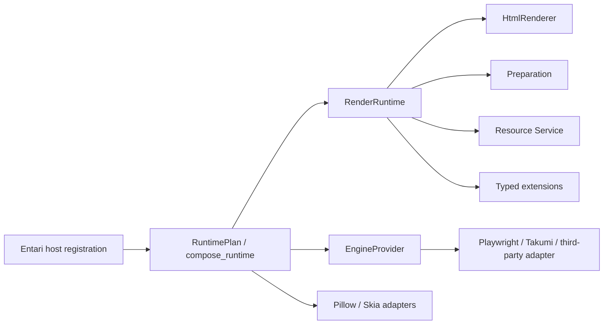

# 分层架构

箭头表示 composition 接线，不表示核心层可以反向依赖宿主。

## Core

`preparation`、`rendering`、`resources`、`runtime` 与顶层 `api` 不导入 Entari、host
composition 或具体 adapter。`parse_html` 是 markup 唯一解析点；通用 use case 只依赖ports 与 typed value objects。

`RenderRuntime` 聚合 `HtmlRenderer`、受 admission gate 保护的 preparation/resources、typed extensions 与 lifecycle。它没有进程全局 locator，宿主通过`RuntimeResolver` 边界交给调用方。

## Provider 与 adapter

`EngineProvider` 解析专属配置、检查 availability、声明资源策略，并通过`compose(settings, dependencies)` 返回 lifecycle、可选 HTML executor 与 capability
catalog。Provider 不读取 Entari 配置，不构造 observer，也不访问 host service。

Playwright 与 Takumi 实现 `PreparedHtmlExecutor`；Pillow/Skia 是独立`RasterSceneRenderer`，不会扩张 HTML Provider 类型。

## Entari host

Entari loader 激活包时，`host.registration.register_plugin()` 声明 metadata/config，读取 `RenderSettings`，调用 `compose_runtime`，再通过 `add_service` 注册`HtmlRenderService`。普通 import 不加载 Entari、adapter 或 composition。

Launart `preparing` / `blocking` / `cleanup` 是唯一宿主生命周期。显式 aiohttp
filehost、runtime drain、错误聚合与热卸载都在 service 边界完成。

需要嵌入其他宿主时，可显式导入`entari_plugin_htmlrender.host.composition.RuntimePlan` / `compose_runtime`，但核心 API仍只接收 `RuntimeSource`。
