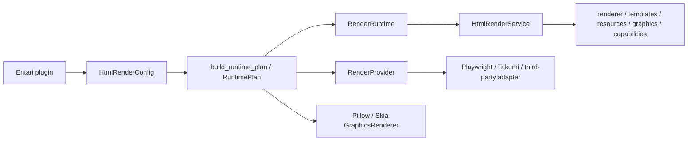

# 分层架构

箭头表示 composition 接线，不表示核心层可以反向依赖宿主。

## Caller contracts

普通业务代码只依赖 package root 的 `HtmlRenderer`、`TemplateRenderer` 与稳定 value
objects，或者 `resources` / `graphics` 子模块的领域 contract。它通过构造器或Entari DI 接收这些对象，不接触 Provider、adapter、runtime controller 或 service
locator。

`HtmlRenderService` 是 Entari concrete service，直接暴露 `renderer`、`templates`、`resources`、`graphics` 与 `capabilities`。它不把内部配置、runtime aggregate 或lifecycle controller 暴露给业务代码。

## Core 与 composition

`preparation`、`rendering`、`resources`、`graphics` 与 `runtime` 不导入 Entari。`parse_html` 是 markup 唯一解析点；有 I/O 的 prepare use cases 留在 runtime 内部，普通 caller 不依赖 preparer facade。

框架无关的 `composition.build_runtime_plan()` 只解析配置、选择一个 Provider 并固定resource strategy，不执行外部 I/O。测试或 embedding 可通过 kw-only
`provider_override=` 注入这一个 Provider。`RuntimePlan` 是 one-shot ownership value：`build_runtime()` 恰好调用一次；再次构建应创建新 plan。Provider 拥有的 parsed config 不复制，计划持有的 filehost server/store 与生成的唯一 runtime 同寿命。`RenderRuntime` 聚合 caller services 与 `OPEN` / `CLOSING` / `CLOSED` lifecycle controller。

## Provider 与 adapter

`RenderProvider` 通过 `parse_config()`、`check_availability()`、`resource_strategy()` 与 `compose()` 穿越边界，并返回 `ProviderBinding`。availability与 compose 不执行 I/O；`startup()` 或首个已获准 Provider operation 才可 lazy acquire资源。Provider 不读取 Entari 配置，不构造 observer/filehost，也不访问 host service。

Playwright 与 Takumi 实现 `PreparedHtmlExecutor`。Pillow/Skia 实现独立的`GraphicsRenderer`，不作为 HTML Provider capability，也不扩张 HTML Provider
contract。需要 native 对象时，调用者进入对应 capability 的显式 lease。

## Entari integration

Entari loader 激活包时，`entari.plugin.register_plugin()` 声明 metadata/config，调用`build_runtime_plan()`，再通过 `add_service` 注册 `HtmlRenderService`。普通 import不加载 Entari integration、adapter 或 composition root。

Launart `preparing` / `blocking` / `cleanup` 是唯一的 Entari 生命周期。显式 aiohttp
filehost、runtime drain、错误聚合与热卸载都在 service 边界完成。

其他宿主可显式导入 `entari_plugin_htmlrender.config.HtmlRenderConfig` 与`entari_plugin_htmlrender.composition.build_runtime_plan`。创建方必须按依赖顺序管理runtime 与可选 `plan.hosted_asset_server`；这组 advanced API 不进入 package root。
