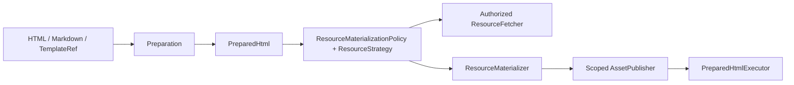

# 资源管线

`parse_html` 固化 `DocumentBase` 与结构快照；后续阶段不得重新解析 markup 推导base。`ResourceFetcher` 在 fetch/cache hit 前执行本地与网络授权。`ResourceMaterializationPolicy` 是单次调用覆盖，`ResourceStrategy` 是 Provider
composition transport；两者都不把 locator 与 payload 混为一谈。

`LocalAccessPolicy` 在本地 fetch、模板与 Provider path 使用前完成授权，`ExecutionLeaseProvider` 则让 Provider/native lease 进入同一 startup/drain 边界。

caller 通过 `ResourceAccess.fetch*()` 从 `ResourceRef` 得到 `ResourceContent`，或通过 `publish()` 在显式 lease 内得到 `PublishedResource`。publication 的 URL 与精确请求头作为一个原子值传播，不得扩张到同 host 其他请求。

远程浏览器通常使用 memory route 或 filehost。选择 filehost 时 composition 显式创建 aiohttp server/store，并把同一 store 注入 publisher。one-shot `RuntimePlan`中的 server/store 与唯一 runtime 同寿命；service cleanup 等待活跃 operation 与publication lease 后再关闭。

所有 fetch、template、publication 与 Provider operation 经过同一个 runtime
admission gate：cleanup 开始后拒绝新操作，已获准操作完成后才释放 cache 与 native
handle。composition 通过 `WorkerExecutor` 隔离阻塞 I/O/native work。
