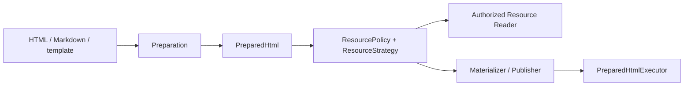

# 资源管线

`parse_html` 固化 `DocumentBase` 与结构快照；后续阶段不得重新解析 markup 推导 base。Resource Reader 在读取/cache hit 前执行本地与网络授权。`ResourcePolicy` 是单次调用覆盖，`ResourceStrategy` 是 Provider composition 策略，两者都不直接执行 I/O。

公共 `resolve_template_vars()` 与 `resolve_resource_url()` 返回`ResourceResolution`。publisher 产生的 header 与精确 URL 一起传播，不会被塞入模板变量树或扩张到同 host 其他请求。

本地 Playwright 可使用内存或允许路径；远程浏览器通常需要 data URL、共享卷或filehost。选择 filehost 时 host composition 显式创建 aiohttp server/store，并把同一 store 注入 publisher。service cleanup 等待活跃 lease 后关闭这些资源。

所有 reader、template environment、publisher 与 Provider operation 都经过同一个runtime admission gate：cleanup 开始后拒绝新操作，已获准操作完成后才释放 cache 与native handle。

核心资源词汇包括 `ResourceRef`、`ResourceContent`、`ResourceReader`、`LocalAccessPolicy` 与 `ResourceService`。composition 通过 `WorkerExecutor` 隔离阻塞I/O/native work，并以 `ExecutionLeaseProvider` 让 materializer/publisher 的租约进入同一 drain 边界。
